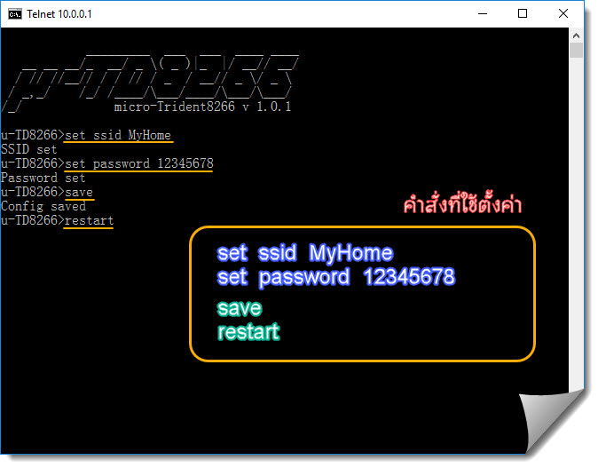
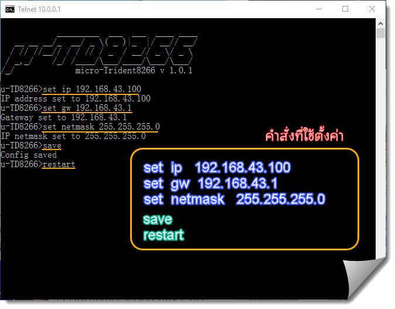
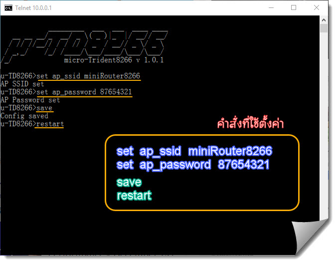
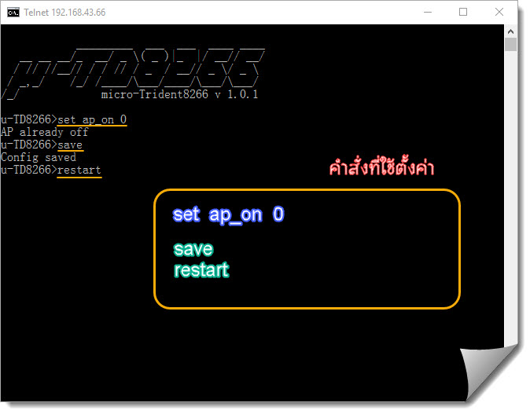
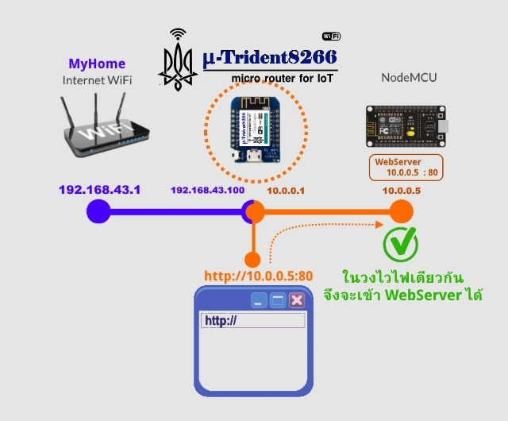
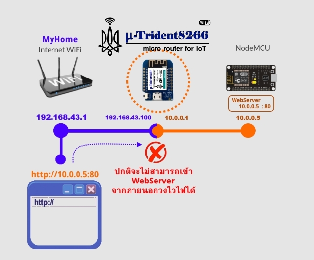
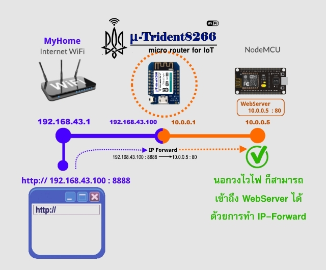

# ต้อนรับสู่ Trident8266RT

**Trident8266RT** เป็นอุปกรณ์สำหรับขยายระยะ Internet WiFi ออกไปได้เรื่อยๆ  
โดยสามารถทำ IP-Forward ได้  
เพื่อ ให้ วงไวไฟ ภายนอก สามารถเข้าถึง ลูกข่ายภายในได้  
ด้วยราคาประหยัด ซึ่ง esp8266 ปกติไม่สามารถทำได้  

พร้อมกันนั้น ยังสามารถประยุกต์ใช้ควบคุมอุปกรณ์ทางการเกษตร  
เพื่องาน Smart Farm 4.0 ตลอดจน งาน IoT อื่นๆได้   

อาทิ ใช้เปิดปิดอุปกรณ์ไฟฟ้า 220VAC ทางไกล  
อ่านและส่งค่าเซนเซอร์ วัดอุณหภูมิ ความชื้นในอากาศทางไกล  
หรือ  วัดความชื้นในดินไกล  
สามารถนำไปทำมอนิเตอร์ หรือ ใช้แอพบนมือถือ  
ทำการ **สั่งการทางไกลด้วยเทคโนโลยี MQTT**  

  

### เหมาะสำหรับ

* **ผู้ใช้ระดับต้น**  - สำหรับขยายระยะ Internet WiFi ด้วยขนาดกระทัดรัด พกพาสะดวก  

* **ผู้ใช้ระดับกลาง**  - สำหรับอนุญาตให้ภายนอกวง WiFi เข้าถึงภายในวง WiFi  

* **นัก Maker** - สำหรับประยุกต์ควบคุมอุปกรณ์/อ่านค่าเซนเซอร์ทางไกลด้วยเทคโนโลยี MQTT  

* **นักพัฒนา Smart Farm/Smart Garden** - สำหรับประยุกต์ควบคุมการเกษตรอัจฉริยะ สวนอัจฉริยะ   
  ช่วยขยายระยะ wifi ในโรงเรือนไปได้เรื่อยๆ พร้อมๆกับสามารถควบคุมทาง IoT ได้ในตัว  
  ด้วยราคาที่เบาสบายลดต้นทุนต่อจุด เหมาะกับการใช้ในงานจริง  

## คู่มือการตั้งค่า  
## ตอนที่ 1 ตั้งค่า WiFi เชื่อมต่อโลก Internet ภายนอก  
## 1.1 ตั้งค่าเชื่อมต่อ Trident8266RT เข้าสู่วง Internet WiFi หลัก  

สมมติ Internet WiFi หลัก มี **ssid ชื่อ MyHome และ password คือ 12345678**  
และต้องการใช้ `Trident8266RT`  ไปเชื่อมต่อเพื่อขยายระยะ wifi  

#### ขั้นตอนการตั้งค่า
ให้ เชื่อมต่อ คอมพิวเตอร์หรือมือถือ เข้าสู่วงไวไฟของ `Trident8266RT` เสียก่อน  
เข้าวงไวไฟด้วยรหัส **password คือ 11223344**  

  

เมื่อเข้ามาในวงไวไฟ `Trident8266RT` แล้ว  
ให้ เปิด Command Prompt ขึ้นมา  แล้วพิมพ์คำสั่ง `telnet 10.0.0.1 5559`   
หากมือถือ ใช้  **แอพ JoiceSSH** ในการเชื่อมต่อ telnet  

  

จะเข้ามาสู่ โหมด ตั้งค่า ดังนี้  

  

กำหนดตั้งค่า ssid , password  ของ Internet WiFi หลัก   
แล้วทำการบันทึกและรีสตาร์ท Trident8266RT  ด้วยคำสั่งดังนี้  

> `set ssid MyHome` - ตั้งค่า ssid ของ Internet WiFi ที่ต้องการเชื่อมต่อ  
>
> `set password 12345678` - ตั้งค่า password ของ Internet WiFi ที่ต้องการเชื่อมต่อ  
>
> `save` - บันทึกที่ได้ตั้งค่าไว้  
>
> `restart` - สั่งให้ รีสตาร์ท Trident8266RT  

ภายหลังรีสตาร์ท Trident8266RT จะเชื่อมเข้าสู่วง Internet WiFi หลักอัตโนมัติ  
อุปกรณ์ไวไฟอื่นๆ ที่มาเชื่อมต่อกับ วงไวไฟ Trident8266RT อีกทอดหนึ่ง  
เช่น คอมพิวเตอร์ หรือ มือถือ หรือ ESP8266 อื่นๆ จะสามารถเข้าถึง Internet ได้ทันทีเช่นกัน  

  

*[กดที่รูปเพื่อดูวิดีโอแสดงตัวอย่างวิธีตั้งค่า WiFi ]*  
  

####<u>หมายเหตุ</u>
* สามารถใช้ Trident8266RT ต่อขยายระยะ Internet WiFI ออกไปได้เรื่อยๆ  
  ให้ครอบคลุมพื้นที่ เรือนเกษตร หรือ บริเวณที่ใช้งาน IoT  
* โดยมีระยะขยาย Internet WiFi ระหว่าง Trident8266RT 2 ตัว  
  ที่ระยะ 25-30 เมตร โดยประมาณ (ขึ้นอยู่กับสิ่งกีดขวาง)  
  พร้อมๆกันนั้น ยังสามารถควบคุมเปิดปิดไฟ ได้   
  (ดูใน ตอนที่ 3 การใช้งาน Smart Farm)

## 1.2 ตั้งค่ากำหนด IP Address ให้ Trident8266RT

หลังเชื่อมต่อเข้าสู่ Internet WiFi หลัก หากไม่กำหนด IP Address  
`Trident8266RT` จะได้รับ IP Address โดยอัตโนมัติ   
และอุปกรณ์ในวง ไวไฟของ `Trident8266RT` ทั้งหมด  
จะสามารถเชื่อมต่อ Internet ได้โดยอัตโนมัติด้วยเช่นกัน  

หากต้องการกำหนดบังคับ `Trident8266RT` ให้มี IP Address คงที่ตามต้องการ   
เช่น ต้องการตั้งค่าให้เป็น 192.168.43.100  
วิธีการติดตั้ง IP Address ,Netmask, Gateway Address แบบกำหนดเองเป็นดังนี้  
( สมมติในวง Internet WiFi หลัก หากมี Gateway 192.168.43.1 )

#### ขั้นตอนการตั้งค่า
ให้เชื่อมต่อไวไฟ `Trident8266RT`  
จากนั้นเข้า Command Prompt แล้วพิมพ์คำสั่ง `telnet 10.0.0.1 5559`    
เพื่อเข้าสู่ โหมดตั้งค่า แล้วพิมพ์คำสั่ง  

> `set ip 192.168.43.100` - ตั้งค่า IP Address ให้ Trident8266RT แบบกำหนดค่าเอง  
>
> `set gw 192.168.43.1` - ตั้งค่า Gateway ของ Internet WiFi ที่ต้องการเชื่อมต่อ  
>
> `set netmask 255.255.255.0` - ตั้งค่า NetMask ของ Internet WiFi ที่ต้องการเชื่อมต่อ  
>
> `save` - บันทึกที่ได้ตั้งค่าไว้  
>
> `restart` - สั่งให้ รีสตาร์ท Trident8266RT  

  

*[กดที่รูปเพื่อดูวิดีโอแสดงตัวอย่างวิธีตั้งค่า IP แบบกำหนดเอง]*  
  

####<u>ข้อควรระวัง</u>  
* IP Address ของ `Trident8266RT` และ Gateway ต้องมีค่าสอดคล้องกัน  
  ไม่เช่นนั้น `Trident8266RT`จะไม่สามารถเชื่อมต่อ Internet ได้  
* ตามปกติแล้ว Gateway จะมีค่า IP คือ xxx.xxx.xxx.1  เป็นต้น  
  ส่วน IP Address ที่จะเลือกกำหนดได้จะเป็น ตั้งแต่ xxx.xxx.xxx.2 - xxx.xxx.xxx.254  
  โดยให้มี Netmask เป็น 255.255.255.0
* ห้ามกำหนด IP Address ซ้ำกับอุปกรณ์ไวไฟอื่นที่เชื่อมต่อ อยู่แล้ว

## 1.3 ตั้งค่าเปลี่ยนชื่อ Access Point ของ Trident8266RT

Access Point Mode คือ โหมดที่ `Trident8266RT` จะทำหน้าที่กระจายวงไวไฟออกไป  
โดยค่าเริ่มต้น Access Point SSID มีชื่อว่า Trident8266RT และมีพาสเวิร์ดคือ 11223344  

อย่างไรก็ตามเราสามารถเปลี่ยนชื่อ Access Point ใหม่ได้  
ตัวอย่าง จะเปลี่ยน Access Point SSID ไปเป็น **miniRouter8266**   
และกำหนดให้เปลี่ยนพาสเวิร์ดค่าใหม่ **87654321** ดังนี้   

#### ขั้นตอนการตั้งค่า
ให้เชื่อมต่อไวไฟ `Trident8266RT`  
จากนั้นเข้า Command Prompt แล้วพิมพ์คำสั่ง `telnet 10.0.0.1 5559`    
เพื่อเข้าสู่ โหมดตั้งค่า   แล้วพิมพ์คำสั่ง   

> `set ap_ssid miniRouter8266` - เปลี่ยนชื่อ Access Point ไปเป็น miniRouter8266  
>
> `set ap_password 87654321` - เปลี่ยนพาสเวิร์ด ไปเป็น 87654321  
>
> `save` - บันทึกที่ได้ตั้งค่าไว้  
>
> `restart` - สั่งให้ รีสตาร์ท Trident8266RT  

  

หลังรีสตาร์ท Trident8266RT จะมีชื่อ Access Point SSID เปลี่ยนไปตามที่ตั้งค่าใหม่ไว้  
  

*[กดที่รูปเพื่อดูวิดีโอแสดงตัวอย่างวิธีเปลี่ยนชื่อ และ พาสเวิร์ดของ  Access Point]*  
  

## 1.4 ตั้งค่า ซ่อน Access Point ของ Trident8266RT

เพื่อป้องกัน ผู้ไม่ประสงค์ดี โจมตี WiFi หรือ กันบุคคลบุกรุกเข้ามาในวงไวไฟ  
เราสามารถตั้งค่า ซ่อน Accesss Point ของ Trident8266RT ได้ดังนี้

ให้เชื่อมต่อไวไฟ `Trident8266RT`  จากนั้น `telnet 10.0.0.1 5559`  
เพื่อเข้าสู่ โหมดตั้งค่า แล้วพิมพ์คำสั่ง  

> `set ap_hidden 1` - กำหนดซ่อน ชื่อ Access Point อุปกรณ์ไวไฟทั่วไปจะมองไม่เห็น  
> หรือ  `set ap_hidden 0` - กำหนดเปิดให้เห็นชื่อ Access Point ตามปกติ  
>
> `save` - บันทึกที่ได้ตั้งค่าไว้  
>
> `restart` - สั่งให้ รีสตาร์ท Trident8266RT  

หลังรีสตาร์ท เครื่องคอมพิวเตอร์  มือถือ ตลอดจนอุปกรณ์ไวไฟอื่นๆ  
จะไม่สามารถมองเห็นชื่อไวไฟของ Trident8266RT ได้  
จะเห็น วงไวไฟที่ซ่อนอยู่ (Hidden Network)  
ยกเว้น อุปกรณ์ที่รู้ชื่อวงไวไฟ และพาสเวิร์ดเท่านั้นจึงจะเข้าได้ตามปกติ  
  

## 1.5 ตั้งค่า ปิดโหมด Access Point ของ Trident8266RT

การปิดโหมด Access Point ของ Trident8266RT  
จะเป็นการหยุดการกระจายสัญญาณไวไฟเพื่อขยายระยะะออกไปอีก  
ตามปกติ Access Point จะเปิดการใช้งาน หากต้องการปิดโหมดนี้ให้ทำดังนี้  

ให้เชื่อมต่อไวไฟ `Trident8266RT`  จากนั้น `telnet 10.0.0.1 5559`  
เพื่อเข้าสู่ โหมดตั้งค่า แล้วพิมพ์คำสั่ง  

> `set ap_on 0` - กำหนดปิด ไม่ใช้โหมด Access Point   
> หรือ  `set ap_on 1` - กำหนดเปิด ให้โหมด Access Point กลับมาใช้ตามปกติ  
>
> `save` - บันทึกที่ได้ตั้งค่าไว้  
>
> `restart` - สั่งให้ รีสตาร์ท Trident8266RT  

  

## ตอนที่ 2 IP-Forward การเชื่อมโลกภายนอก ให้เข้าถึง อุปกรณ์ภายใน Trident8266RT
## 2.1 IP-Forward คืออะไร?

วงไวไฟหนึ่งๆ ตามปกติแล้วจะไม่อนุญาตในวงไวไฟภายนอกอื่นๆ  
สามารถเข้าถึงอุปกรณ์ที่เชื่อมต่อในวงไวไฟภายในได้เพื่อความปลอดภัย  

อย่างไรก็ตาม หากวงไวไฟนั้นๆ  
แม่ข่าย มีคุณสมบัติพิเศษในการส่งทอดต่อ ไปยังลูกข่ายให้ได้   
อุปกรณ์ภายนอกวงไวไฟก็จะสามารถส่งข้อมูลสื่อสารได้ถึงลูกข่ายของวงไวไฟนั้นๆได้  
โดยผ่านทาง แม่ข่ายของวงไวไฟนั้นๆ  
ด้วยการกำหนดจับคู่ IP และ Port ภายนอกของแม่ข่าย 
เข้ากับ IP และ Port ภายใน เข้าด้วยกัน  
คุณสมบัตินี้เรียกว่า IP-Forward  

ตัวอย่างเช่น  
วงไวไฟ Trident8266RT ซึ่งเป็นแม่ข่ายไวไฟ มี IP ภายในคือ 10.0.0.1  
และได้มีลูกข่ายเป็น NodeMCU เข้ามาเชื่อมต่อ  
โดยมีการกำหนดให้มี IP คือ 10.0.0.5 และ Port 80 ได้เปิดทำหน้าที่เป็น WebServer  

  

หาก คอมพิวเตอร์ หรือ มือถือ เชื่อมต่อ Trident8266RT ด้วย  
คอมพิวเตอร์ หรือ มือถือ ย่อมเข้าถึง WebServer บน NodeMCU  นี้ได้  
ด้วย  http://10.0.0.5:80  

แต่หากวงไวไฟ Trident8266RT เชื่อมต่อ แม่ข่ายหลัก Internet WiFi อีกชั้นหนึ่ง  
ได้รับ IP ภายนอก จากแม่ข่าย Internet WiFi คือ 192.168.43.100  

แล้ว คอมพิวเตอร์ มาเชื่อมต่อ แม่ข่ายหลัก Internet WiFi ด้วย  
คอมพิวเตอร์ นี้จะไม่สามารถเข้าถึง WebServer บน NodeMCU นี้ได้โดยเด็ดขาด  

  

แต่ด้วย เทคโนโลยี IP-Forward ที่มีใน Trident8266RT  
เราสามารกำหนด การจับคู่ IPและ Port ภายนอก เพื่อเชื่อมโยง กับ IP และ Port ภายในได้  
เช่น กำหนดให้ Trident8266RT ซึ่งมี IP ภายนอก 192.168.43.100 ให้ Port 8888  
เป็นตัวแทน ส่งต่อข้อมูลสื่อสารไปยัง IP ภายใน ของ NodeMCU คือ 10.0.0.5 Port 80  
หรือเขียนได้ดังนี้  

192.168.43.100:8888 -> 10.0.0.5:80  

หากคอมพิวเตอร์ที่เชื่อมอยู่บนวงไวไฟหลัก Internet WiFi ไม่ได้อยู่ในวงไวไฟ Trident8266RT   
แต่ก็จะสามารถเข้าถึง WebServer บน NodeMCU ได้ ด้วย IP และ Port ตัวแทน  
คือ  http://192.168.43.100:8888  แทน  
เป็นต้น

ESP8266 ที่ปกติพัฒนาด้วย ESP8266-SDK  
ที่ออกมาจากทางบริษัท Espressif ผู้ผลิตชิพ ESP8266  โดยตรง  
เช่น  Arduino-ESP8266 บน Arduino-IDE ได้ใช้ ESP8266-SDK ในการพัฒนา   
คำสั่งต่างๆ นั้นจะไม่สามารถทำ คุณสมบัติที่เรียกว่า IP-Forward ได้

## ตั้งค่า MQTT Client
## 4. ตั้งค่า MQTT Broker ที่ Trident8266RT ใช้ส่งค่า/รับค่า

## Project layout

    mkdocs.yml    # The configuration file.
    docs/
        index.md  # The documentation homepage.
        ...       # Other markdown pages, images and other files.
